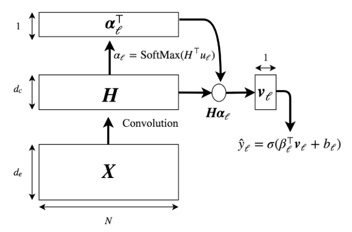
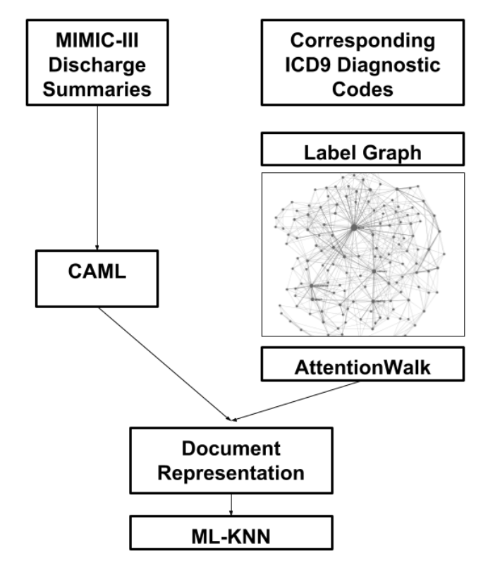
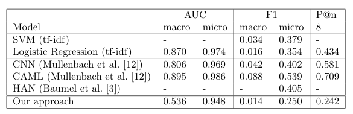

# Auto Diagnosis
## Automatic diagnosis code (ICD-9) assignment from doctor's notes

This project was developed as part of the Deep Learning (Fall 2018) course, lead by Thomas Hofmann, together with Orhun Ozbek, Akmaral Yessenalina, Brynja Sigurpalsdottir, and unofficially published as [**Extreme Multi-Label Classification of Disease Codes From Medical Text (2019)**](misc/auto_diagnose_2019_report.pdf)

## Idea
The purpose of this project is multi-label classification of disease diagnosis codes (ICD9) in patient discharge notes from MIMIC-III dataset. We compare and improve on the several state-of-the-art deep learning methods (CNNs, Hierarchical Attention Networks, RNNs).

## Models
### Convolutional Attention for Multi-Label classification (CAML) model is described below:



`X` - embedding matrix, with `N` words (truncated to 2,500) and embedding dimension `de`


`H` - non-linear activation matrix, obtained by passing embeddings through a convolutional filter `Wc` with dimensions `d_e` (input embedding), `d_c` (filter output) and `k` (filter width)


`al` - per-label attention

`vl` - vector representation for each label


### Multi-label Classification scheme for medical discharge records is described below:


1. Learn doctors notes document embeddings with CAML procedure above 
1. Instead of using label vectors as the target variables directly, we obtained 256-dim label graph embeddings by using AttentionWalk algorithm. For each document, corresponding label embeddings are aggregated by taking by averaging. Resulting representation of the document is used as the target vector for multi-target regression.

1. Resulting document embeddings are mapped to the label power set using Multi-Label K-Nearest Neighbor (ML-KNN) algorithm


### Our model resulted in similar metric performance to CAML and CNN state-of-the-art models:



# To run the project:

1. Clone the git repository from the source or copy
and paste the project documents.

1. Change directory to the project root, 
create a new virtual environment and install
requirements.txt

    ```console
    $ python3 -m virtualenv venv
    $ source venv/bin/activate
    $ pip install -r requirements.txt
    ```

1. Download MIMIC-III data files according to the instructions specified at
[full data link](https://physionet.org/works/MIMICIIIClinicalDatabase/files/).
Getting access requires completing a course about data processing and a special
approval.

1. There are two classification types to run, the first one is the embedding_classification.py which is described in our project.
The second one (classification.py), is implemented to test the strategies which 
involve `n` binary classifications (`n` = number of labels).

    ```console
    
    usage: embedding_classification.py [-h] [--train_word2vec]
                                       [--train_attentionwalk] [-m {CAML,CNN,RNN}]
                                       [-g GPU]
    
    optional arguments:
      -h, --help            show this help message and exit
      --train_word2vec      Use this flag if you want train word2vec embeddings
                            from scratch, or embeddings are going to be loaded
                            from path/to/project/embeddings/word2vec_embeddings_300.model
      --train_attentionwalk
                            Use this flag if you want train attentionwalk label
                            embeddings from scratch, or embeddings are going to be
                            loaded from
                            path/to/project/embeddings/icd_embedding.csv
      -m {CAML,CNN,RNN}, --model_name {CAML,CNN,RNN}
                            Model for the regressor
      -g GPU, --gpu GPU     gpu ordinal to run Pytorch models. device will be set to
                            cuda:gpu
    ```

1. You can adjust the system paths (data, models, model outputs and logging) and hyperparameters by editing `constants.py`
1. Run embedding classification (it takes approximately 6 hours on GPU):

    ```console
    $ cd code
    $ python embedding_classification.py --train_word2vec --train_attentionwalk 
    ```